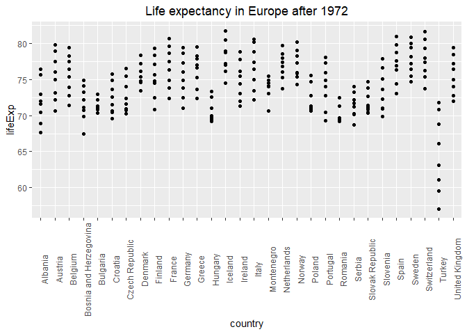

hw005-MeiqiYu.Rmd
================
Meiqi Yu
2018-10-15

## Introduction

The goal of this assignment is to dig further in factor and plot
management. This assignment includes four parts.

For this assignment, I will be using the gapminder dataframe.

``` r
suppressPackageStartupMessages(library(tidyverse))
suppressPackageStartupMessages(library(plotly))
library(knitr)
library(gapminder)
```

## Part 1: Factor management

For this part, I choose the varibles `country` and `continent`. The
first thing to do is to ensure the varibles I’m exploring are indeed
facrots.

### Are `country` and `continent` factors?

``` r
is.factor(gapminder$continent)
```

    ## [1] TRUE

``` r
is.factor(gapminder$country)
```

    ## [1] TRUE

### Look at the levels of `continent`

``` r
fct_count(gapminder$continent) %>% 
kable()
```

| f        |   n |
| :------- | --: |
| Africa   | 624 |
| Americas | 300 |
| Asia     | 396 |
| Europe   | 360 |
| Oceania  |  24 |

### Drop Oceania -level and factor

Let’s drop all the rows of `Oceania`, the new data frame is named as
`gap_drop_oceania`.

``` r
gap_drop_oceania <- gapminder %>%
    filter(continent != "Oceania")
fct_count(gap_drop_oceania$continent) %>% 
kable()
```

| f        |   n |
| :------- | --: |
| Africa   | 624 |
| Americas | 300 |
| Asia     | 396 |
| Europe   | 360 |
| Oceania  |   0 |

``` r
nrow(gapminder)
```

    ## [1] 1704

``` r
nrow(gap_drop_oceania)#check the number of rows before and after change
```

    ## [1] 1680

From the table above, we can know that all the rows of Oceania have been
removed, but the factor still remains. The original `gapminder` data
frame has 1704 rows and 5 factors. The new `gap_drop_oceania` data frame
has 1680 rows and 5 factors.

Now, let’s drop the unused factor, the new data frame is named as
`gap_no_oceania`.

``` r
gap_no_oceania <- gap_drop_oceania %>% 
  droplevels()
fct_count(gap_no_oceania$continent) %>% 
kable()
```

| f        |   n |
| :------- | --: |
| Africa   | 624 |
| Americas | 300 |
| Asia     | 396 |
| Europe   | 360 |

``` r
nrow(gap_no_oceania)#check the number of rows after change
```

    ## [1] 1680

It looks like that Oceania has been removed as an unused factor. The new
`gap_no_oceania` data frame has 1680 rows and 4 factors.

### Reorder the levels of `country` and `continent`

This task is to use the forcats package to change the order of the
factor levels, based on a principled summary of one of the quantitative
variables. I will reorder the columns based on the maximum value of the
pop.

``` r
# First, I would like to simply reorder the columns based on the iqr of the columns
gap_no_oceania %>%
    mutate(continent = fct_reorder(continent, pop, max)) %>%
    ggplot(aes(continent, pop, fill = continent)) +
    scale_y_log10()+
    geom_violin() +
    labs(title = "population each continent")+
    theme(plot.title = element_text(hjust = 0.5)) #center the title
```

<!-- -->

Now, let’s explore the effects of `arrange()` individually.

``` r
gap_no_oceania %>%
    group_by(continent, pop) %>%
    summarise(max_pop = max(pop)) %>%
    arrange(desc(max_pop)) %>%
    ggplot(aes(continent,pop, fill = continent)) +
    scale_y_log10()+
    geom_violin() +
    labs(title = "population each continent")+
    theme(plot.title = element_text(hjust = 0.5)) #center the title
```

<!-- -->

Comparing these two plots above, we can know that: \* `arrange()` only
has effects on rows, not on factors, so the order of `continent` does
NOT change in the second plot. \* factor reordering coupled with
`arrange()` does have effects on the order of the factor, so `continent`
is in the order of the increase of the maximum value of pop.

## Part 2: File I/O

### Make a new data frame

To begin with this part, I will first make a small and reasonable data
frame called `gap_Europe`. This data frame includes all the lifeExp of
each European countries after 1972. We can see see that it is in the
order of alphabet.

``` r
gap_Europe <- gapminder %>%
    filter(continent == "Europe"& year >= 1972) %>% 
    select(country,lifeExp)
gap_Europe %>%     
kable()
```

| country                  |          lifeExp |
| :----------------------- | ---------------: |
| Albania                  |           67.690 |
| Albania                  |           68.930 |
| Albania                  |           70.420 |
| Albania                  |           72.000 |
| Albania                  |           71.581 |
| Albania                  |           72.950 |
| Albania                  |           75.651 |
| Albania                  |           76.423 |
| Austria                  |           70.630 |
| Austria                  |           72.170 |
| Austria                  |           73.180 |
| Austria                  |           74.940 |
| Austria                  |           76.040 |
| Austria                  |           77.510 |
| Austria                  |           78.980 |
| Austria                  |           79.829 |
| Belgium                  |           71.440 |
| Belgium                  |           72.800 |
| Belgium                  |           73.930 |
| Belgium                  |           75.350 |
| Belgium                  |           76.460 |
| Belgium                  |           77.530 |
| Belgium                  |           78.320 |
| Belgium                  |           79.441 |
| Bosnia and Herzegovina   |           67.450 |
| Bosnia and Herzegovina   |           69.860 |
| Bosnia and Herzegovina   |           70.690 |
| Bosnia and Herzegovina   |           71.140 |
| Bosnia and Herzegovina   |           72.178 |
| Bosnia and Herzegovina   |           73.244 |
| Bosnia and Herzegovina   |           74.090 |
| Bosnia and Herzegovina   |           74.852 |
| Bulgaria                 |           70.900 |
| Bulgaria                 |           70.810 |
| Bulgaria                 |           71.080 |
| Bulgaria                 |           71.340 |
| Bulgaria                 |           71.190 |
| Bulgaria                 |           70.320 |
| Bulgaria                 |           72.140 |
| Bulgaria                 |           73.005 |
| Croatia                  |           69.610 |
| Croatia                  |           70.640 |
| Croatia                  |           70.460 |
| Croatia                  |           71.520 |
| Croatia                  |           72.527 |
| Croatia                  |           73.680 |
| Croatia                  |           74.876 |
| Croatia                  |           75.748 |
| Czech Republic           |           70.290 |
| Czech Republic           |           70.710 |
| Czech Republic           |           70.960 |
| Czech Republic           |           71.580 |
| Czech Republic           |           72.400 |
| Czech Republic           |           74.010 |
| Czech Republic           |           75.510 |
| Czech Republic           |           76.486 |
| Denmark                  |           73.470 |
| Denmark                  |           74.690 |
| Denmark                  |           74.630 |
| Denmark                  |           74.800 |
| Denmark                  |           75.330 |
| Denmark                  |           76.110 |
| Denmark                  |           77.180 |
| Denmark                  |           78.332 |
| Finland                  |           70.870 |
| Finland                  |           72.520 |
| Finland                  |           74.550 |
| Finland                  |           74.830 |
| Finland                  |           75.700 |
| Finland                  |           77.130 |
| Finland                  |           78.370 |
| Finland                  |           79.313 |
| France                   |           72.380 |
| France                   |           73.830 |
| France                   |           74.890 |
| France                   |           76.340 |
| France                   |           77.460 |
| France                   |           78.640 |
| France                   |           79.590 |
| France                   |           80.657 |
| Germany                  |           71.000 |
| Germany                  |           72.500 |
| Germany                  |           73.800 |
| Germany                  |           74.847 |
| Germany                  |           76.070 |
| Germany                  |           77.340 |
| Germany                  |           78.670 |
| Germany                  |           79.406 |
| Greece                   |           72.340 |
| Greece                   |           73.680 |
| Greece                   |           75.240 |
| Greece                   |           76.670 |
| Greece                   |           77.030 |
| Greece                   |           77.869 |
| Greece                   |           78.256 |
| Greece                   |           79.483 |
| Hungary                  |           69.760 |
| Hungary                  |           69.950 |
| Hungary                  |           69.390 |
| Hungary                  |           69.580 |
| Hungary                  |           69.170 |
| Hungary                  |           71.040 |
| Hungary                  |           72.590 |
| Hungary                  |           73.338 |
| Iceland                  |           74.460 |
| Iceland                  |           76.110 |
| Iceland                  |           76.990 |
| Iceland                  |           77.230 |
| Iceland                  |           78.770 |
| Iceland                  |           78.950 |
| Iceland                  |           80.500 |
| Iceland                  |           81.757 |
| Ireland                  |           71.280 |
| Ireland                  |           72.030 |
| Ireland                  |           73.100 |
| Ireland                  |           74.360 |
| Ireland                  |           75.467 |
| Ireland                  |           76.122 |
| Ireland                  |           77.783 |
| Ireland                  |           78.885 |
| Italy                    |           72.190 |
| Italy                    |           73.480 |
| Italy                    |           74.980 |
| Italy                    |           76.420 |
| Italy                    |           77.440 |
| Italy                    |           78.820 |
| Italy                    |           80.240 |
| Italy                    |           80.546 |
| Montenegro               |           70.636 |
| Montenegro               |           73.066 |
| Montenegro               |           74.101 |
| Montenegro               |           74.865 |
| Montenegro               |           75.435 |
| Montenegro               |           75.445 |
| Montenegro               |           73.981 |
| Montenegro               |           74.543 |
| Netherlands              |           73.750 |
| Netherlands              |           75.240 |
| Netherlands              |           76.050 |
| Netherlands              |           76.830 |
| Netherlands              |           77.420 |
| Netherlands              |           78.030 |
| Netherlands              |           78.530 |
| Netherlands              |           79.762 |
| Norway                   |           74.340 |
| Norway                   |           75.370 |
| Norway                   |           75.970 |
| Norway                   |           75.890 |
| Norway                   |           77.320 |
| Norway                   |           78.320 |
| Norway                   |           79.050 |
| Norway                   |           80.196 |
| Poland                   |           70.850 |
| Poland                   |           70.670 |
| Poland                   |           71.320 |
| Poland                   |           70.980 |
| Poland                   |           70.990 |
| Poland                   |           72.750 |
| Poland                   |           74.670 |
| Poland                   |           75.563 |
| Portugal                 |           69.260 |
| Portugal                 |           70.410 |
| Portugal                 |           72.770 |
| Portugal                 |           74.060 |
| Portugal                 |           74.860 |
| Portugal                 |           75.970 |
| Portugal                 |           77.290 |
| Portugal                 |           78.098 |
| Romania                  |           69.210 |
| Romania                  |           69.460 |
| Romania                  |           69.660 |
| Romania                  |           69.530 |
| Romania                  |           69.360 |
| Romania                  |           69.720 |
| Romania                  |           71.322 |
| Romania                  |           72.476 |
| Serbia                   |           68.700 |
| Serbia                   |           70.300 |
| Serbia                   |           70.162 |
| Serbia                   |           71.218 |
| Serbia                   |           71.659 |
| Serbia                   |           72.232 |
| Serbia                   |           73.213 |
| Serbia                   |           74.002 |
| Slovak Republic          |           70.350 |
| Slovak Republic          |           70.450 |
| Slovak Republic          |           70.800 |
| Slovak Republic          |           71.080 |
| Slovak Republic          |           71.380 |
| Slovak Republic          |           72.710 |
| Slovak Republic          |           73.800 |
| Slovak Republic          |           74.663 |
| Slovenia                 |           69.820 |
| Slovenia                 |           70.970 |
| Slovenia                 |           71.063 |
| Slovenia                 |           72.250 |
| Slovenia                 |           73.640 |
| Slovenia                 |           75.130 |
| Slovenia                 |           76.660 |
| Slovenia                 |           77.926 |
| Spain                    |           73.060 |
| Spain                    |           74.390 |
| Spain                    |           76.300 |
| Spain                    |           76.900 |
| Spain                    |           77.570 |
| Spain                    |           78.770 |
| Spain                    |           79.780 |
| Spain                    |           80.941 |
| Sweden                   |           74.720 |
| Sweden                   |           75.440 |
| Sweden                   |           76.420 |
| Sweden                   |           77.190 |
| Sweden                   |           78.160 |
| Sweden                   |           79.390 |
| Sweden                   |           80.040 |
| Sweden                   |           80.884 |
| Switzerland              |           73.780 |
| Switzerland              |           75.390 |
| Switzerland              |           76.210 |
| Switzerland              |           77.410 |
| Switzerland              |           78.030 |
| Switzerland              |           79.370 |
| Switzerland              |           80.620 |
| Switzerland              |           81.701 |
| Turkey                   |           57.005 |
| Turkey                   |           59.507 |
| Turkey                   |           61.036 |
| Turkey                   |           63.108 |
| Turkey                   |           66.146 |
| Turkey                   |           68.835 |
| Turkey                   |           70.845 |
| Turkey                   |           71.777 |
| United Kingdom           |           72.010 |
| United Kingdom           |           72.760 |
| United Kingdom           |           74.040 |
| United Kingdom           |           75.007 |
| United Kingdom           |           76.420 |
| United Kingdom           |           77.218 |
| United Kingdom           |           78.471 |
| United Kingdom           |           79.425 |
| To see it clearly, I put | it into a graph. |

``` r
gap_Europe %>%
  ggplot(aes(country, lifeExp)) +
  geom_point() +
  labs(title = "LifExp in Europe after 1972") +
  theme(axis.text.x = element_text(angle = 90))+
  # use the theme function to rotate x axis to avoid overlapping
  theme(plot.title = element_text(hjust = 0.5)) #center the title
```

<!-- --> \#\#\#
Make the data frame non-alphabetical

Now let’s make it non-alphabetical.The new data frame is called
`gap_Europe_reorder`. I make it in the order of the increase of the
minimum value of lifeExp and plot the graph below which looks more
reasonable.

``` r
gap_Europe_reorder<- gap_Europe %>% 
  mutate(country = fct_reorder(country, lifeExp, min))
gap_Europe_reorder %>% 
  ggplot(aes(country, lifeExp)) +
  geom_point() +
  labs(title = "Life expectancy in Europe after 1972") +
  theme(axis.text.x = element_text(angle = 90))+
  # use the theme function to rotate x axis to avoid overlapping
  theme(plot.title = element_text(hjust = 0.5)) #center the title
```

<!-- -->

### Experiment with `write_csv()/read_csv()`

``` r
write_csv(gap_Europe_reorder,"gap_Europe_reorder.csv")
read_csv("gap_Europe_reorder.csv") %>% 
  ggplot(aes(country, lifeExp)) +
  geom_point() +
  labs(title = "Life expectancy in Europe after 1972") +
  theme(axis.text.x = element_text(angle = 90))+
  # use the theme function to rotate x axis to avoid overlapping
  theme(plot.title = element_text(hjust = 0.5)) #center the title
```

    ## Parsed with column specification:
    ## cols(
    ##   country = col_character(),
    ##   lifeExp = col_double()
    ## )

<!-- -->

It’s abvious that the order does NOT survive - it is alphabetical again
now.

### Experiment with `saveRDS()/readRDS()`

``` r
saveRDS(gap_Europe_reorder,"gap_Europe_reorder.rds")
readRDS("gap_Europe_reorder.rds") %>% 
  ggplot(aes(country, lifeExp)) +
  geom_point() +
  labs(title = "Life expectancy in Europe after 1972") +
  theme(axis.text.x = element_text(angle = 90))+
  # use the theme function to rotate x axis to avoid overlapping
  theme(plot.title = element_text(hjust = 0.5)) #center the title
```

<!-- -->

Yes, the order keeps the same through the round trip of
saveRDS()/readRDS().

### Experiment with `dput()/dget()`

``` r
dput(gap_Europe_reorder,"gap_Europe_reorder.dput")
dget("gap_Europe_reorder.dput") %>% 
  ggplot(aes(country, lifeExp)) +
  geom_point() +
  labs(title = "Life expectancy in Europe after 1972") +
  theme(axis.text.x = element_text(angle = 90))+
  # use the theme function to rotate x axis to avoid overlapping
  theme(plot.title = element_text(hjust = 0.5)) #center the title
```

<!-- -->

Yes, the order also keeps the same through the round trip of
dput()/dget().

## Part 3: Visualization design

### Remark a figure

In this part, the task is to remark a new figure, in light of something
I learned in the recent class meetings about visualization design and
color. I am going to replot the first figure I plotted in assignment 2.
In this figure, I meaned to show the relationship between lifeExp and
gdpPercap, but the plot looks squished at the bottom.

``` r
ggplot(gapminder,aes(x=lifeExp, y=(gdpPercap)))+
  geom_point(color='steelblue',size=1)
```

<!-- -->

Now, let’s remark this figure and call it `new_gap`.

``` r
new_gap <-gapminder %>% 
  group_by(continent,year) %>% 
  ggplot(aes(y=lifeExp, x=gdpPercap,color = lifeExp))+
  facet_wrap(~continent)+
  scale_x_log10()+
  geom_point(size=1)+
  labs(title = "Relationship between lifeExp and gdpPercap")+
  theme_bw()+
  theme(plot.title = element_text(hjust = 0.5),
        axis.text  = element_text(size=12),
        strip.background = element_rect(fill = "orange"))
new_gap
```

<!-- -->

Now, the figure looks more reasonable based on the following aspects: \*
1. by `scale_x_log10()`, the plots do NOT look squished any more. \* 2.
by `facet_wrap()`, the original figure is faceted into 5 figures by
continents, so the relationship can be seen more clearly for each
continent \* 3. by `color=`, the new figure shows the value of lifeExp
intuitivly. \* 4. the title is added and centered which completes the
figure.

### Convert it into a plotly graph (Results only applicable in .html)

``` r
#new_gap %>% 
#  ggplotly()
```

### Convert it into a 3D plot

Now, take Asia for an example, let’s add year to form a z-axis for a 3D
plot.

``` r
#gapminder %>% 
#   filter(continent == "Asia") %>% 
#   plot_ly(
#        x = ~gdpPercap, 
#        y = ~lifeExp, 
#        z = ~year,
#        color = ~country, # color by country
#        type = "scatter3d",
#        mode = "markers",
#        opacity = 0.5) %>% 
#   layout(xaxis = list(type = "log"), 
#       yaxis = list(type = "log" ))  # log x and y
```

### Part 4: Writing figures to file

``` r
new_gap # choose new_gap to save
```

<!-- -->

``` r
ggsave("new_gap_file.png",new_gap, width=15, height=10, units = "cm")
```


